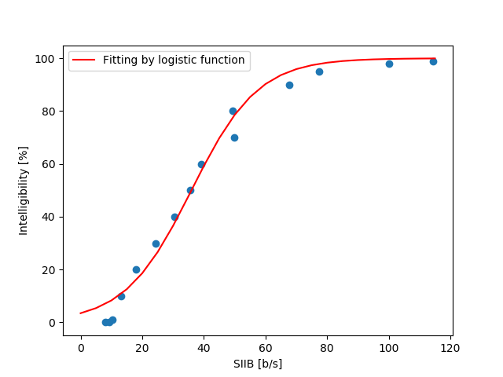
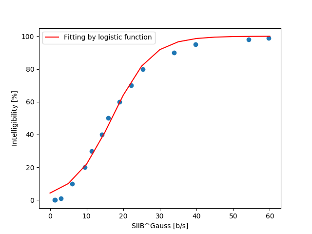

# pySIIB: A python implementation of speech intelligibility in bits (SIIB)

[](https://travis-ci.org/kamo-naoyuki/pySIIB)
[](https://codecov.io/gh/kamo-naoyuki/pySIIB)

SIIB is an intrusive instrumental intelligibility metric based on infortmation theory.
This Python implementation of SIIB is ported from the author's matlab codes: https://stevenvankuyk.com/matlab_code/.
The behaviour is almost compatible of original codes.

## Install

```bash
pip install git+https://github.com/kamo-naoyuki/pySIIB.git
```


## Usage

```python
from pysiib import SIIB
from scipy.io import wavefile

fs, x = wavfile.read("clean.wav")
fs, y = wavfile.read("distorted.wav")

# SIIB with MI function in C-implementation (this is used in [1],[2])
SIIB(x, y, fs)
# SIIB with MI function in python implementation
SIIB(x, y, fs, use_MI_Kraskov=False)
# SIIB^Gauss
SIIB(x, y, fs, gauss=True)
```

There are two version metrics called as SIIB [1] and  SIIB^Gauss [2].
SIIB^Gauss has similar performance to SIIB, but takes less time to
compute.

## IMPORTANT

- SIIB assumes that x and y are time-aligned.
- SIIB may not be reliable for stimuli with short durations(e.g., less than 20 seconds). Note that longer stimuli can be created by concatenating short stimuli together.

## Demo

```bash
cd demo
python demo.py
```




## Reference

- [1] S. Van Kuyk, W. B. Kleijn, and R. C. Hendriks, ‘An instrumental intelligibility metric based on information theory’, IEEE Signal Processing Letters, 2018.
- [2] S. Van Kuyk, W. B. Kleijn, and R. C. Hendriks, ‘An evaluation of intrusive instrumental intelligibility metrics’, IEEE/ACM Transactions on Audio, Speech, and Language Processing, 2018.
